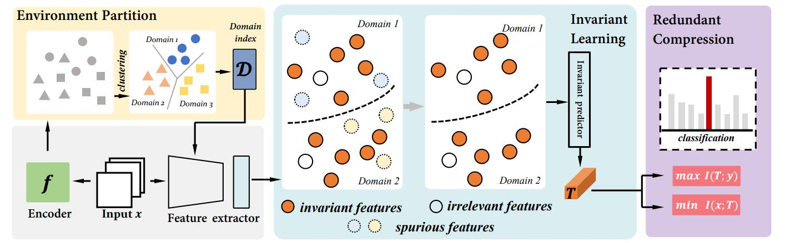

# IMS
This repository contains the code for the paper "**Coping with Change: Learning Invariant and Minimum Sufficient Representations for Fine-Grained Visual Categorization**"

 

## Abstract:  
  - Fine-grained visual categorization~(FGVC) is a challenging task due to similar visual appearances between various species. 
Previous studies always implicitly assume that the training and test data have the same underlying distributions, and that features extracted by modern backbone architectures remain discriminative and generalize well to unseen test data.
However, we empirically justify that these conditions are not always true on benchmark datasets.
To this end, we combine the merits of invariant risk minimization (IRM) and information bottleneck (IB) principle to learn invariant and minimum sufficient~(IMS) representations for FGVC, such that the overall model can always discover the most succinct and consistent fine-grained features. 
We apply the matrix-based R{\'e}nyi's $\alpha$-order entropy to simplify and stabilize the training of IB; we also design a ``soft" environment partition scheme to make IRM applicable to FGVC task. To the best of our knowledge, we are the first to address the problem of FGVC from a generalization perspective and develop a new information-theoretic solution accordingly. 
Extensive experiments demonstrate the consistent performance gain offered by our IMS.
  
## Reference:
Please note that: our code is based on https://github.com/falesiani/GIB. If you intend to use our code, kindly reference this article. 

<table><tr><td bgcolor=DarkSeaGreen>
@inproceedings{alesiani2021gated,\\
  title={Gated Information Bottleneck for Generalization in Sequential Environments},\\
  author={Alesiani, Francesco and Yu, Shujian and Yu, Xi},\\
  booktitle={2021 IEEE International Conference on Data Mining (ICDM)},\\
  pages={1--10},\\
  year={2021},\\
  organization={IEEE}\\
}
</td></tr><table>

For further research on information theory, you can refer to: https://arxiv.org/abs/1808.07912.
